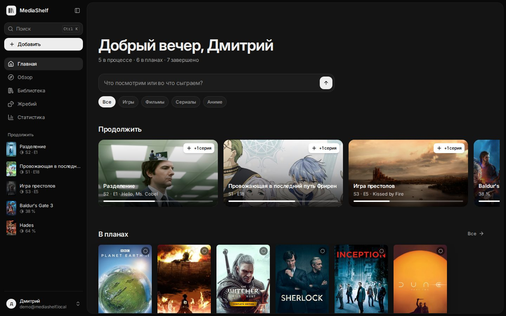
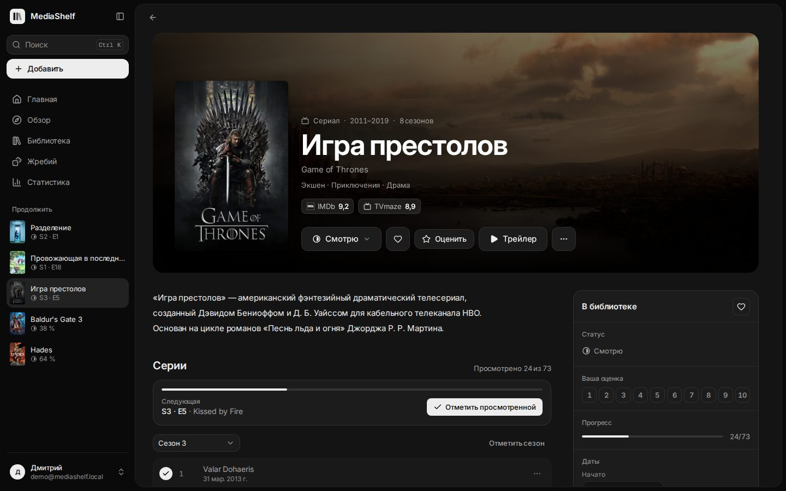
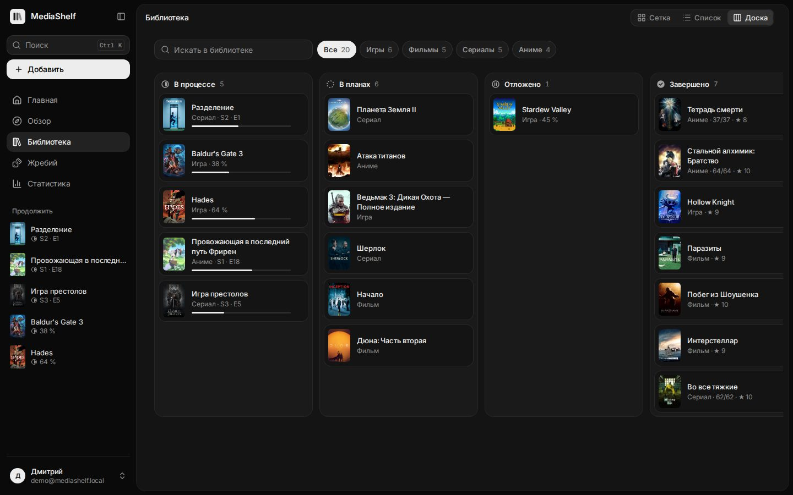
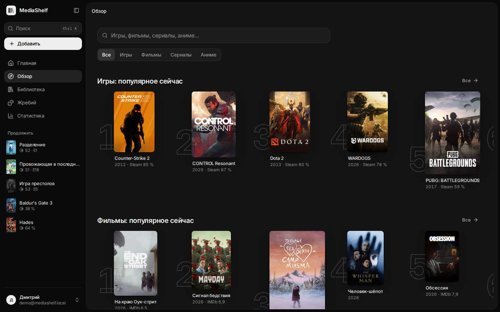
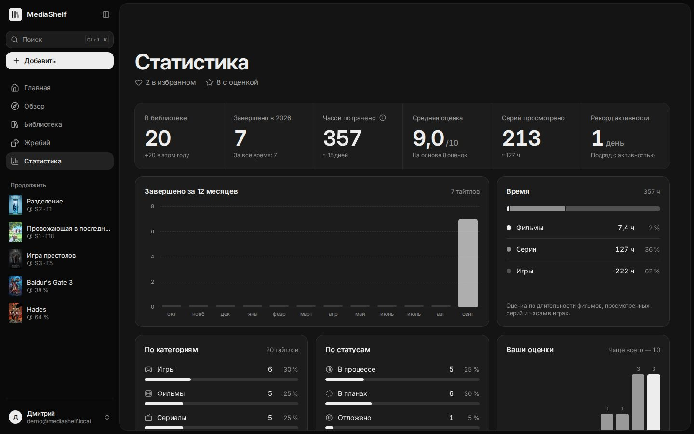
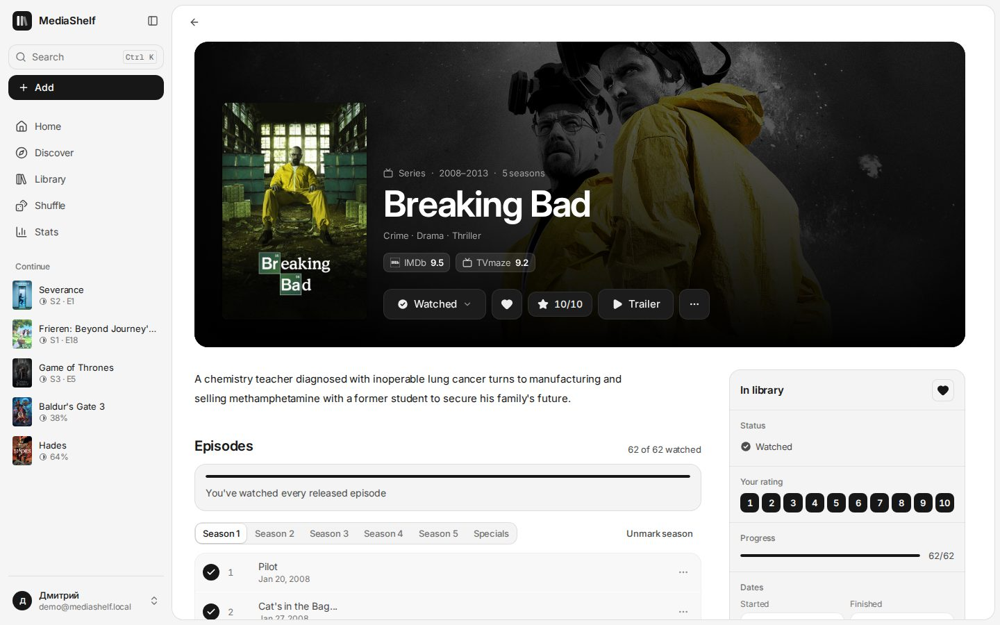
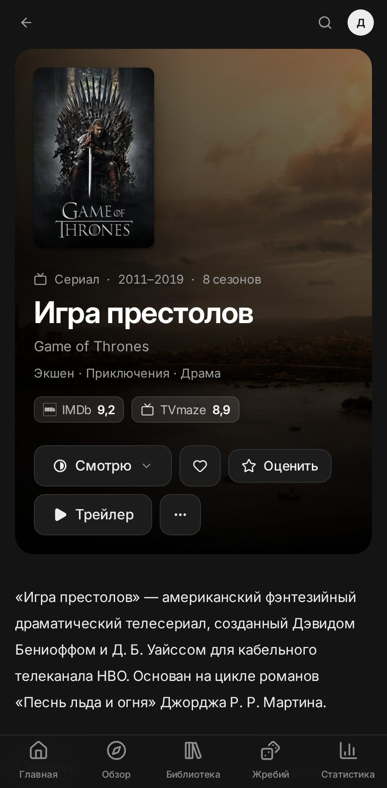

# MediaDeck

Личная библиотека игр, фильмов, сериалов и аниме. Каталоги подключены без ключей API, у каждого пользователя свой аккаунт, а все данные хранятся в одном файле SQLite на вашем компьютере.

_English summary at the end._



<table>
  <tr>
    <td></td>
    <td></td>
  </tr>
  <tr>
    <td></td>
    <td></td>
  </tr>
  <tr>
    <td></td>
    <td align="center"></td>
  </tr>
</table>

## Возможности

- **Главная.** Приветствие, «Продолжить» с кнопкой «+1 серия», планы, популярное по категориям, лента недавних действий.
- **Обзор.** Поиск по всем категориям (в том числе по-русски), топы «Популярное», «Лучшее за всё время», «Новинки». Фильтры по жанру, сортировка, «скрыть добавленные».
- **Страница тайтла.** Фон и постер, рейтинги IMDb / Steam / Metacritic / Shikimori / AniList, описание на русском или английском, трейлер, кадры, подробности, ссылки на источники.
- **Библиотека.** Три вида: сетка, список и доска статусов с перетаскиванием. Поиск, фильтры по категории и статусу, избранное, сортировка. Все фильтры сохраняются в адресе страницы.
- **Статусы:** В планах, В процессе, Отложено, Завершено, Брошено. У фильмов только «Хочу посмотреть» и «Просмотрено».
- **Сериалы и аниме.** Реальный список сезонов и серий. Можно отмечать серию, сезон или «все до этой», писать заметки и ставить оценку каждой серии. Статус меняется сам: первая серия переводит в «Смотрю», последняя серия завершившегося сериала — в «Просмотрено».
- **Игры.** Основное прохождение: платформа, магазин, прогресс, часы. До 9 дополнительных прохождений (другая платформа, NG+, кооператив). Цены Steam и GOG для вашего региона со скидками, ссылки на другие магазины.
- **Жребий** (бывший «Что сегодня?»). Случайный выбор из библиотеки (по статусам и категориям) или из популярного, с анимацией барабана и историей результатов.
- **Статистика.** Итоги года, часы, серии, средняя оценка, завершённое по месяцам, распределение оценок, любимые жанры, рекорд активности.
- **Настройки.** Профиль, тема (системная / светлая / тёмная), язык (русский / English), платформы, магазины и регион цен, смена пароля, активные сеансы, экспорт и импорт JSON, удаление аккаунта.
- **Быстрый поиск** — `Ctrl K` (или `/`). Библиотека, каталог, переходы и действия в одном окне.
- Мобильная версия с нижней панелью вкладок, работа с клавиатуры, поддержка «уменьшить движение», тёмная и светлая темы без мигания при загрузке.

## Запуск на Windows (самый простой способ)

1. Установите **Node.js 24 LTS** с <https://nodejs.org>.
2. Дважды щёлкните `start.cmd` в папке проекта. При первом запуске он сам установит зависимости и соберёт сайт.
3. Откройте <http://localhost:4175> и создайте аккаунт.

Остановить сервер — закрыть окно. Данные лежат в `data\mediashelf.db`.

## Запуск из терминала

```powershell
npm install
npm run build
npm start          # http://localhost:4175
```

Режим разработки (горячая перезагрузка интерфейса и API):

```powershell
npm run dev        # интерфейс http://127.0.0.1:5173, API на порту 4174
```

## Доступ с телефона в той же Wi-Fi

Создайте файл `.env` рядом с `package.json`:

```ini
HOST=0.0.0.0
```

Перезапустите сервер и откройте на телефоне `http://<IP-адрес ноутбука>:4173`. IP можно узнать командой `ipconfig`. Windows спросит разрешение для Node.js в брандмауэре — разрешите для частных сетей. Сайт можно «Добавить на главный экран» как приложение.

## Настройки сервера (`.env`)

Все параметры описаны в `.env.example`. Основные:

| Переменная           | По умолчанию | Что делает                                                          |
| -------------------- | ------------ | ------------------------------------------------------------------- |
| `HOST`               | `127.0.0.1`  | `0.0.0.0` — доступ из локальной сети                                |
| `PORT`               | `4173`       | Порт сайта                                                          |
| `DATA_DIR`           | `data`       | Папка базы данных                                                   |
| `ALLOW_REGISTRATION` | `true`       | `false` — закрыть регистрацию (первый аккаунт создать можно всегда) |
| `SESSION_DAYS`       | `30`         | Сколько дней действует вход без активности                          |
| `TRUST_PROXY`        | `false`      | `true` только за своим HTTPS-прокси (Caddy, nginx)                  |
| `COOKIE_SECURE`      | `auto`       | Cookie с флагом Secure для HTTPS                                    |

## Резервные копии и обновление

- **Резервная копия** — скопируйте папку `data` при остановленном сервере. Отдельную библиотеку можно скачать в «Настройки → Данные → Экспорт».
- **Обновление** — `git pull`, `npm install`, `npm run build`, перезапуск. Схема базы обновляется автоматически.

## Когда захотите выложить в интернет

Сервер уже готов к публикации: пароли хешируются scrypt, сессии хранятся в HttpOnly-cookie (в базе — только хеш токена), есть защита от CSRF по Origin, ограничение попыток входа, строгий CSP и заголовки безопасности.

1. Поставьте перед MediaDeck HTTPS-прокси. Например, Caddy: `media.example.com { reverse_proxy 127.0.0.1:4173 }`.
2. В `.env`: `TRUST_PROXY=true`, после создания своих аккаунтов — `ALLOW_REGISTRATION=false`.
3. Или Docker: `docker compose up -d --build`. Данные хранятся в томе `mediadeck-data`.

## Откуда данные

Ключи API не нужны. Все ответы кешируются: частые — в памяти, дорогие (названия и описания из Википедии) — в SQLite.

- **Игры:** Steam (чарты, поиск, описания, отзывы, цены), GOG (каталог и цены).
- **Фильмы и сериалы:** IMDb-поиск, Cinemeta (топы, описания, трейлеры), TVmaze (серии), Wikidata и Википедия (русские названия и описания).
- **Аниме:** Shikimori (русские названия и описания), AniList (тренды, английские описания, фоны), MyAnimeList через Jikan (названия серий).

Если источник недоступен, библиотека продолжает работать: сохранённые тайтлы и списки серий хранятся локально.

## Проверки

```powershell
npm run check       # TypeScript + ESLint + модульные и API-тесты
npx playwright install chromium   # один раз
npm run test:e2e    # сборка и сквозные тесты в браузере (офлайн-каталог, база в памяти)
```

## Устройство проекта

```
shared/            общие типы, схемы zod, статусы, жанры, регионы
server/            Node.js 24 + Hono; TypeScript запускается без сборки
  auth/            пароли (scrypt), сессии, пользователи
  catalog/         Steam, GOG, Cinemeta, IMDb, TVmaze, Shikimori, AniList, Wikidata
  library/         записи, серии, прохождения, активность, статистика, экспорт
  routes/          HTTP API
  db/              SQLite (node:sqlite) и миграции
src/               React 19 + Vite + Tailwind CSS 4 + Radix + TanStack Query
  app/             оболочка: боковая панель, мобильные вкладки, Ctrl K
  components/      дизайн-система (ui/) и общие компоненты
  pages/           страницы
  i18n/            русский (основной) и английский
tests/e2e/         сквозные тесты Playwright
```

Дизайн описан в [DESIGN.md](DESIGN.md), продукт — в [PRODUCT.md](PRODUCT.md).

---

## English summary

MediaDeck is a self-hosted library for games, movies, series and anime. It has accounts, episode and playthrough tracking, a status board, stats, Shuffle (random pick), a Ctrl K command palette, and Russian and English UI in light and dark themes.

**Run:** install Node.js 24, then `npm install && npm run build && npm start` and open http://localhost:4175. On Windows you can double-click `start.cmd` instead. Data lives in `data/mediashelf.db`. Settings are in `.env.example`.

## Credits

Animal avatars use [OpenMoji](https://openmoji.org) (black set), licensed CC BY-SA 4.0.
